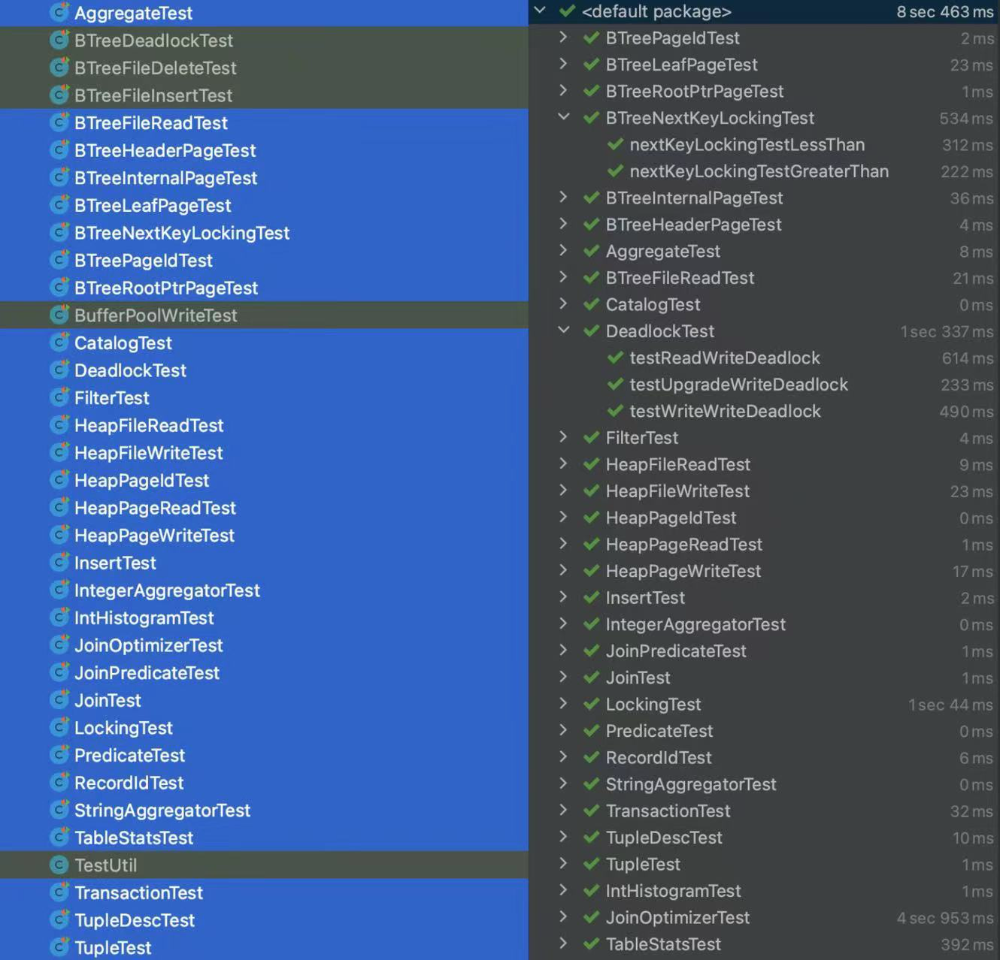
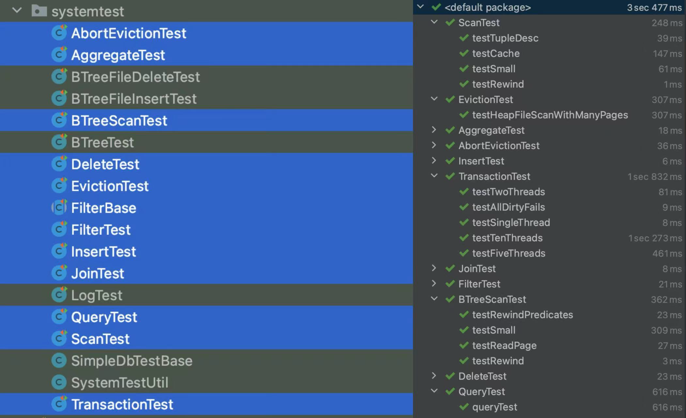

# MIT 6.830 Lab Summary

终于抽空基本完成了lab6.830，一直想做一个数据库lab，因为之前对数据库的理解基本来源于书本以及开发中调试获得的经验，缺少单独的数据库实践，通过学习这个lab我对数据库的整体架构和设计方法有了更深入、更具象的理解。

总体来说，该lab代码方面，主体代码结构清晰、抽象合理，测试代码比较完备、能测出一些细节bug；文档方面，说明文档基本完备，不过看风格似乎不像是同一个人写的，无论怎样，建议开始每个lab之前通读一遍文档而不是读到某个exercise就开始上手实验；课程方面，质量还是很高的，但是似乎不如分布式6.824讲解得清晰（虽然6.824我只看过一点，半途而废了，但是好课确实听一听就能感受出来哈哈，如果有大佬可以带带我）。

**实验建议：**

阅读数据库系统概念等书籍，配合视频学习基础知识，上手实验时先阅读文档再开始代码实验，必要时画出关键类图，实验代码中的注释要格外注意，因为其中可能描述了实验的细节要求，按照该要求实现能够比较顺利地通过测试，一些情况下不按照要求实现也可行，但是需要自己编写测试用例。因为该lab是逐步搭建一个数据库，所以各个lab的代码之间具有依赖性，实验应尽量做到上一个lab测试全部通过、文档要求的功能完备，否则很可能给接下来的实验埋坑，众所周知，bug拖的越久越不容易测出，我在lab4中亲身体会到了这一点。lab4是实验的重点，我认为该lab是实验的精华所在，独立设计并实现一个锁管理器及其考验对数据库锁、事务相关知识的理解，完成该实验有助于提升多线程编程能力、代码设计组织能力。

**题外话：**

很佩服设计写出这个实验的助教，想要完整设计出一个代码可读性强、架构完整、基本功能完备的数据库其复杂度并不低，如果一个人独立写出来的话可以说是很难的。

**实验的优化点：**

该实验似乎并未考虑字符串长度过长的情况等。


##### **测试完成情况：**

1️⃣UnitTest



2️⃣SystemTest



lab6非重点，略。


course-info
===========

GitHub Repo for http://dsg.csail.mit.edu/6.830/

We will be using git, a source code control tool, to distribute labs in 6.814/6.830. This will allow you to
incrementally download the code for the labs, and for us to push any hot fixes that might be necessary.

You will also be able to use git to commit and backup your progress on the labs as you go. Course git repositories will
be hosted as a repository in GitHub. GitHub is a website that hosts runs git servers for thousands of open source
projects. In our case, your code will be in a private repository that is visible only to you and course staff.`

This document describes what you need to do to get started with git, and also download and upload 6.830/6.814 labs via
GitHub.

**If you are not a registered student at MIT, you are welcome to follow along, but we ask you to please keep your solution PRIVATE and not make it
publicly available**

## Contents

- [Learning Git](#learning-git)
- [Setting up GitHub](#setting-up-github)
- [Installing Git](#installing-git)
- [Setting up Git](#setting-up-git)
- [Getting Newly Released Labs](#getting-newly-released-lab)
- [Word of Caution](#word-of-caution)
- [Help!](#help)

## Learning Git

There are numerous guides on using Git that are available. They range from being interactive to just text-based. Find
one that works and experiment; making mistakes and fixing them is a great way to learn. Here is a link to resources that
GitHub suggests:
[https://help.github.com/articles/what-are-other-good-resources-for-learning-git-and-github][resources].

If you have no experience with git, you may find the following web-based tutorial
helpful: [Try Git](https://try.github.io/levels/1/challenges/1).

## <a name="setting-up-github"></a> Setting Up GitHub

Now that you have a basic understanding of Git, it's time to get started with GitHub.

0. Install git. (See below for suggestions).

1. If you don't already have an account, sign up for one here: [https://github.com/join][join].

### Installing git <a name="installing-git"></a>

The instructions are tested on bash/linux environments. Installing git should be a simple `apt-get / yum / etc install`.

Instructions for installing git on Linux, OSX, or Windows can be found at
[GitBook:
Installing](http://git-scm.com/book/en/Getting-Started-Installing-Git).

If you are using Eclipse/IntelliJ, many versions come with git configured. The instructions will be slightly different than the
command line instructions listed but will work for any OS. Detailed instructions can be found
at [EGit User Guide](http://wiki.eclipse.org/EGit/User_Guide)
, [EGit Tutorial](http://eclipsesource.com/blogs/tutorials/egit-tutorial), or
[IntelliJ Help](https://www.jetbrains.com/help/idea/version-control-integration.html).

## Setting Up Git <a name="setting-up-git"></a>

You should have Git installed from the previous section.

1. The first thing we have to do is to clone the current lab repository by issuing the following commands on the command
   line:

   ```bash
    $ git clone https://github.com/MIT-DB-Class/simple-db-hw-2021.git
   ```

   Now, every time a new lab or patch is released, you can

   ```bash
    $ git pull
   ```
   to get the latest. 
   
   That's it. You can start working on the labs! That said, we strongly encourage you to use git for more than just
   downloading the labs. In the rest of the guide we will walk you through on how to use git for version-control
   during your own development. 

2. Notice that you are cloning from our repo, which means that it will be inappropriate for you to push your code to it.
   If you want to use git for version control, you will need to create your own repo to write your changes to. Do so 
   by clicking 'New' on the left in github, and make sure to choose **Private** when creating, so others cannot see your
   code! Now we are going to change the repo we just checked out to point to your personal repository.

3. By default the remote called `origin` is set to the location that you cloned the repository from. You should see the following:

   ```bash
    $ git remote -v
        origin https://github.com/MIT-DB-Class/simple-db-hw-2021.git (fetch)
        origin https://github.com/MIT-DB-Class/simple-db-hw-2021.git (push)
   ```

   We don't want that remote to be the origin. Instead, we want to change it to point to your repository. To do that, issue the following command:

   ```bash
    $ git remote rename origin upstream
   ```

   And now you should see the following:

   ```bash
    $ git remote -v
        upstream https://github.com/MIT-DB-Class/simple-db-hw-2021.git (fetch)
        upstream https://github.com/MIT-DB-Class/simple-db-hw-2021.git (push)
   ```

4. Lastly we need to give your repository a new `origin` since it is lacking one. Issue the following command, substituting your athena username:

   ```bash
    $ git remote add origin https://github.com/[your-repo]
   ```

   If you have an error that looks like the following:

   ```
   Could not rename config section 'remote.[old name]' to 'remote.[new name]'
   ```

   Or this error:

   ```
   fatal: remote origin already exists.
   ```

   This appears to happen to some depending on the version of Git they are using. To fix it, just issue the following command:

   ```bash
   $ git remote set-url origin https://github.com/[your-repo]
   ```

   This solution was found from [StackOverflow](http://stackoverflow.com/a/2432799) thanks to [Cassidy Williams](https://github.com/cassidoo).

   For reference, your final `git remote -v` should look like following when it's setup correctly:


   ```bash
    $ git remote -v
        upstream https://github.com/MIT-DB-Class/simple-db-hw-2021.git (fetch)
        upstream https://github.com/MIT-DB-Class/simple-db-hw-2021.git(push)
        origin https://github.com/[your-repo] (fetch)
        origin https://github.com/[your-repo] (push)
   ```

5. Let's test it out by doing a push of your master branch to GitHub by issuing the following:

   ```bash
    $ git push -u origin master
   ```

   You should see something like the following:

   ```
	Counting objects: 59, done.
	Delta compression using up to 4 threads.
	Compressing objects: 100% (53/53), done.
	Writing objects: 100% (59/59), 420.46 KiB | 0 bytes/s, done.
	Total 59 (delta 2), reused 59 (delta 2)
	remote: Resolving deltas: 100% (2/2), done.
	To git@github.com:MIT-DB-Class/homework-solns-2018-<athena username>.git
	 * [new branch]      master -> master
	Branch master set up to track remote branch master from origin.
   ```


6. That last command was a bit special and only needs to be run the first time to setup the remote tracking branches.
   Now we should be able to just run `git push` without the arguments. Try it and you should get the following:

   ```bash
    $ git push
      Everything up-to-date
   ```

If you don't know Git that well, this probably seemed very arcane. Just keep using Git and you'll understand more and
more. You aren't required to use commands like commit and push as you develop your labs, but will find them useful for
debugging. We'll provide explicit instructions on how to use these commands to actually upload your final lab solution.

## Getting Newly Released Labs <a name="getting-newly-released-lab"></a>

(You don't need to follow these instructions until Lab 1.)

Pulling in labs that are released or previous lab solutions should be easy as long as you set up your repository based
on the instructions in the last section.

1. All new lab and previous lab solutions will be posted to the [labs](https://github.com/MIT-DB-Class/simple-db-hw)
   repository in the class organization.

   Check it periodically as well as Piazza's announcements for updates on when the new labs are released.

2. Once a lab is released, pull in the changes from your simpledb directory:

   ```bash
    $ git pull upstream master
   ```

   **OR** if you wish to be more explicit, you can `fetch` first and then `merge`:

   ```bash
    $ git fetch upstream
    $ git merge upstream/master
   ```
   Now commit to your master branch:
   ```bash
	$ git push origin master
   ```

3. If you've followed the instructions in each lab, you should have no merge conflicts and everything should be peachy.

## <a name="word-of-caution"></a> Word of Caution

Git is a distributed version control system. This means everything operates offline until you run `git pull`
or `git push`. This is a great feature.

The bad thing is that you may forget to `git push` your changes. This is why we **strongly** suggest that you check
GitHub to be sure that what you want us to see matches up with what you expect.

## <a name="help"></a> Help!

If at any point you need help with setting all this up, feel free to reach out to one of the TAs or the instructor.
Their contact information can be found on the [course homepage](http://db.csail.mit.edu/6.830/).

[join]: https://github.com/join

[resources]: https://help.github.com/articles/what-are-other-good-resources-for-learning-git-and-github

[ssh-key]: https://help.github.com/articles/generating-ssh-keys
