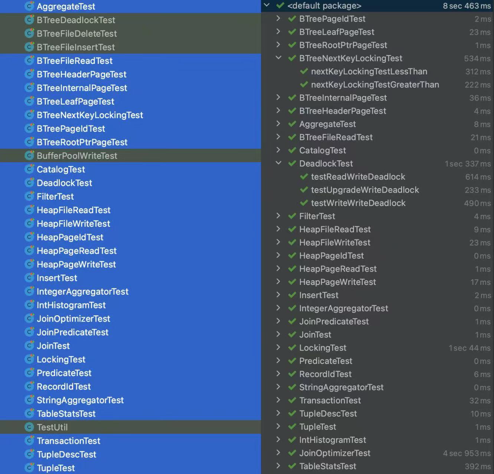

# MIT 6.830 Lab Summary

终于抽空基本完成了lab6.830，一直想做一个数据库lab，因为之前对数据库的理解基本来源于书本以及开发中调试获得的经验，缺少单独的数据库实践，通过学习这个lab我对数据库的整体架构和设计方法有了更深入、更具象的理解。

总体来说，该lab代码方面，主体代码结构清晰、抽象合理，测试代码比较完备、能测出一些细节bug；文档方面，说明文档基本完备，不过看风格似乎不像是同一个人写的，无论怎样，建议开始每个lab之前通读一遍文档而不是读到某个exercise就开始上手实验；课程方面，质量还是很高的，但是似乎不如分布式6.824讲解得清晰（虽然6.824我只看过一点，半途而废了，但是好课确实听一听就能感受出来哈哈，如果有大佬可以带带我）。

**实验建议：**

阅读数据库系统概念等书籍，配合视频学习基础知识，上手实验时先阅读文档再开始代码实验，必要时画出关键类图，实验代码中的注释要格外注意，因为其中可能描述了实验的细节要求，按照该要求实现能够比较顺利地通过测试，一些情况下不按照要求实现也可行，但是需要自己编写测试用例。因为该lab是逐步搭建一个数据库，所以各个lab的代码之间具有依赖性，实验应尽量做到上一个lab测试全部通过、文档要求的功能完备，否则很可能给接下来的实验埋坑，众所周知，bug拖的越久越不容易测出，我在lab4中亲身体会到了这一点。lab4是实验的重点，我认为该lab是实验的精华所在，独立设计并实现一个锁管理器及其考验对数据库锁、事务相关知识的理解，完成该实验有助于提升多线程编程能力、代码设计组织能力。

**题外话：**

很佩服设计写出这个实验的助教，想要完整设计出一个代码可读性强、架构完整、基本功能完备的数据库其复杂度并不低，如果一个人独立写出来的话可以说是很难的。

**实验的优化点：**

该实验似乎并未考虑字符串长度过长的情况等。

##### **测试完成情况：**

1️⃣UnitTest

2️⃣SystemTest

lab6非重点，略。

