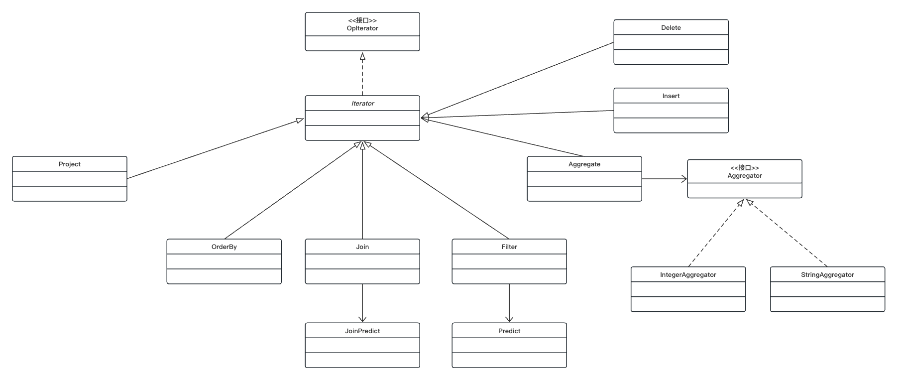

# Lab2 Operators

用时：2day

其中一个小用例有问题，目前感觉是测试写的不太对，也可能是我的理解有一点问题，到后面再看。

理解了lab2的实验文档之后，lab2整体感觉比lab1更简单。

### Exercise 1

完成Filter和Join，可以参考实验中已经实现了的Project和OrderBy。挺简单的，在写fetchNext()的时候需要注意一下边界条件。

### Exercise 2

Aggregate继承Operator（Operator实现了OpIterator，所有的operaor都实现了OpIterator），使用Aggregator接口帮助完成聚合操作，比较简单。

### Exercise 3

这是lab3的重点，完成HeapPage、HeapFile、BufferPool中的insertTuple、deleteTuple方法。delete比较容易，直接修改page中header部分对应的位（为0），insert需要找到一个有空闲位置的页面，如果没有空闲页面，需要自己新建一个页面，然后将tuple插入页面，同样修改header部分对应位（为1），将页面标记为脏页。

对于Exercise 3的一个测试有点问题，待更新。

### Exercise 4

实现Insert、Delete两个operator，由于只需要返回影响的记录的数量，所以很简单，注意一下这两个operator在一次open后只能调用一次fetchNext。

### Exercise 5

实现一个简单的buffer pool缓冲池页面驱逐方案，不具体要求使用什么驱逐策略，很简单。

lab2新涉及类的类图

