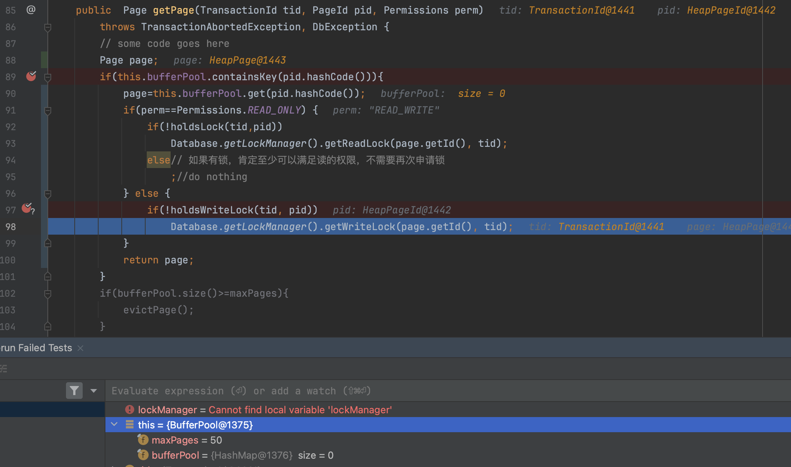
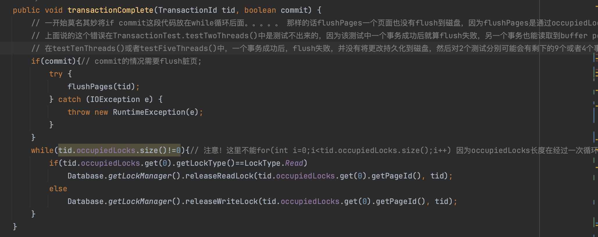

# Lab4 SimpleDB Transactions

用时：10day

用时较长，一部分原因是时间与学期开始阶段课程作业时间重叠，另外就是lab4相比前3个lab，难度上升了一个大台阶。

本实验实现了一个简单的locking-based transaction system，在具备数据库基础知识的前提下，精读文档、学习部分课程视频可以完成实验。主要难点在于锁管理器的实现，我的方法是新建一个LockManager类，在类中维护一个map记录哪些页面上有锁，类方法使用同步方法，需要考虑的细节有map的中应该存放什么类型的数据、需不需要对锁新建数据结构、并发访问控制等等。此外，事务abort时如何回滚、BufferPool空间不足需要驱逐页面时哪些页面能够驱逐都是需要考虑的细节实现。

关于Debug：

Locking and transactions can be quite tricky to debug!

lab4涉及多线程，在出现bug时需要多线程调试，目前我使用了两种方法：

1. 利用IDEA的多线程调试器，打断点时右键断点，将断点设置为Thread级别，优点是只需手动添加断点然后debug模式运行即可，缺点是由于代码中存在wait(time)方法，手动调试时由于在断点处会额外停留一段时间，所以打断点调试时观察到的程序行为与直接运行程序看到的行为非常可能不一样、或者说大概率不一样。
2. 在程序的关键位置/可能出错的位置添加打印方法，打印出锁管理器的状态、BufferPool的状态、事务的状态或者其他关键变量，直接运行程序，查看打印进行调试。

关键词：

 transaction、two-phase locking、concurrency control、锁升级

## Exercise 1 & Exercise 2

要求：实现一个页面粒度加锁的锁管理器，基于锁管理器完善BufferPool的getPage()方法，实现unsafeReleasePage()、holdsLock()方法。

数据结构设计：

新建LockManager用于管理锁的获取和释放，LockManager在Database类中注册（类似BufferPool）；新建Lock类，记录锁的类型，哪些事务持有该锁；在类TransactionId（Transaction的唯一标识）中添加局部变量ArrayList<Lock> occupiedLocks用于记录事务持有了哪些锁。

实现细节：

实验要求实现两阶段锁（在事务commit或者abort后才统一释放锁，有一个例外是在插入tuple时需要加读锁读取页面以找到一个empty slot用于插入新的记录、如果发现一个页面没有空余位置可以立即释放读锁）、事务独占读锁则读锁可以升级为写锁。细节：注意wait()和notify()的使用，检查修改页面时有没有调用markDirty()方法，根据Permissions申请锁等等。

## Exercise 3

比较容易，修改BufferPool.evictPage()，实现no steal，即不能驱逐被一个未提交事务持有锁的脏页（事务回滚时这种脏页可以discard、从BufferPool删除，但是此操作不能称为页面驱逐）。

## Exercise 4

需注意细节，否则易出错。

要求：实现BufferPool的transactionComplete()方法等，在事务commit或者abort时进行相应处理。

abort时：

丢弃修改过的页面（或者恢复修改过的页面），实现中选择丢弃修改的页面（采用此种方式应注意，如果对于该事务占用的某个读锁，其他事务也在共享，则不能直接从BufferPool中discard删除页面，**否则会出现丢失修改的情况，下面详细记录了这个bug**）；释放事务占用的锁。

commit时：

将脏页flush回磁盘持久化存储；释放事务占用的锁。

## Exercise 5

要求：实现死锁检测或预防

目前我简单地通过在LockManager中设置超时来处理死锁，通过离散化超时时间降低死锁的可能性，这就要求超时时间不能过短、各个事务的超时时间不能一样，实现是设置一个超时基数TIMEOUT_MILLIS，超时是乘以一个大于0的随机数（一定不能为0，否则wait()不会超时而是会持续等待、产生死锁），其中超时基数不能过小，否则随机数的意义就不大了，不能将超时时间显著区分开。

如果不设置随机超时时间，或者设置随机超时但是超时基数过小，则有很大可能发生如下情况：

事务A、B先共享一把读锁，接着都想升级读锁，事务A 先超时并abort，还没有来得及释放读锁（让事务B独占读锁从而具备升级读锁的条件），**事务B就已经超时**，与预期的事务B能够升级读锁不一致。

这个问题在DeadlockTest中测试不出来，因为该测试中失败的事务不会重新执行，在TransactionTest中会测试出来，该测试中失败的事务会abort然后新建一个事务执行同样的内容，相当于事务失败会重试。

## Debug记录

TransactionTest有报错，执行测试多次，可能出现不同的报错：

1. 测试中的assert不通过，tuple中的值与事务个数不一致

   事务A读取数据值为0，更新为1并写入

   此时预期情况时事务B必须读取到最新的1，然后更新为2并写入

   但是现在的错误时，事务B读取数据值为0，更新为1，然后写入

2. 测试抛出错误，DbException("this tuple is not on this page");

可能的错误：

- 可能的错误是**加锁有问题**，事务B读取到事务A更新之前的0
- **其他问题，debug最后发现是丢失修改（加锁没问题，事务B确实读取到了最新的）。**

事务A、B执行相同的内容，先获得读锁、然后获得写锁，获得写锁时会发生争抢：其中一个事务必须先失败，让另外一个事务得以升级锁

事务A失败，将该事务持有锁的页面释放，从buffer pool移除（这一步并没有违反实验要求的no steal原则，也就是不驱逐脏页），然后释放持有的读锁

事务A退让、释放读锁之后，事务B得以将读锁升级为写锁，然后执行delete，但是此时出现了一个不合理的情况：事务B持有读锁的这个页面居然不在buffer pool中。详细的整体流程是：**事务B试图删除的时候去buffer pool中获取页面，发现页面在buffer pool中所以就不从磁盘加载了，然后走到下面标记的一行并进入，得益于事务A超时abort了，事务B成功将独占的读锁升级为写锁，然后返回下面标记的一行，此时由于事务A超时并abort掉了（释放读锁的同时连带将该读锁对应的页面discard掉、从buffer pool移除了），事务A进入下面的标记行时buffer pool中有该页面，获得读锁返回时该页面没了，这种状态是错误的！**

为什么 错误：首先显然看起就错误、逻辑就不对，其次详细一些说，虽然此时buffer pool中没有该页面，但是90行的page已经有值了，会正常返回，然后delete操作将该页面中的一条记录删除，但是这个删除既没有反映在buffer pool中，也没有反映在磁盘中，所以这个删除其实是无效的，正常情况应该是会反映在buffer pool中（修改均在内存的缓冲池中进行），最后事务commit的时候写到磁盘。

所以优化一下事务的abort和buffer pool的discardPage：abort的时候，循环待abort事务占用的页面，如果该页面上还有别的事务加锁了，则不discard（其实就是读锁共享的时候不discard，因为如果是写锁的话、写锁排他，肯定是单独占有，一定为discard掉，这和预期的abort一个事务会丢弃修改是一样的）

问题：abort的时候是驱逐脏页，即直接discard脏页，还是从磁盘reload该页面。

**暂时**先discard，discard的时候不discard有共享读锁的，但是不一定能通过**AbortEvictionTest**（试验证明可以通过）

事务B从磁盘加载页面进行接下来的写相关操作，它将持续占有一段时间，此时事务C要求获得读锁显然会超时失败（不需要释放锁、也不需要调用discardPage从buffer pool中移除页，因为根本没获取到锁）。

这个bug也是导致我设置了很多打印，却发现事务delete掉仅有的一个tuple之后，读取该表仍然有tuple的原因，因为delete的删除没有反映在buffer pool，更不可能直接反映在磁盘中，完全失效了。于是事务插入之后，实际上表里有了两行数据，一行是0，一行是1，下一个事务读取到第一行的0，然后删除所有tuple，但是删除失效，事务又插入了一个1，此时表中实际上有了3行数据，一行是0，还有两行是1。TransactionTest这个测试真的给力，测出了这个bug。如果通过update的方式更新初始（每次对仅有的一行值加1然后update）仅有的一行数据，而不是先删除再插入，那么update会像delete一样失效，update之后值仍然为0，这个bug就更离谱。

为了找出这个bug，添加了大量的print代码，因为多线程调试可用性不高（自己debug停顿时费时间，运行时不会这么费时，代码里有wait，debug的时候因为停顿时间过长，debug代码的运行结果与实际直接运行很可能不一样），不太能找得出bug。

另外一个bug，源自buffer pool中下面这个方法，注释给出了说明：

### bug总结

第一个bug是自己埋下的坑，其实之前已经注意到这里的细节，在事务abort需要discard页面的代码处，我添加了一行todo注释，提示自己要注意处理“discard时，该页面上其他事务也占有锁”的情况，但是没有及时处理，导致了最后处理这个bug耗时很长，所以搭建项目todo还是要尽早处理哈哈。

第二个bug完全就是有点随心所欲了...

## 可以升级的地方：

实现不同粒度的锁、根据依赖检测死锁等

Lab4新涉及的类：

主要集中在simpledb.transaction文件夹中，其中新增了锁管理器需要的类：LockManager、Lock，类关系简明、省略类图。
