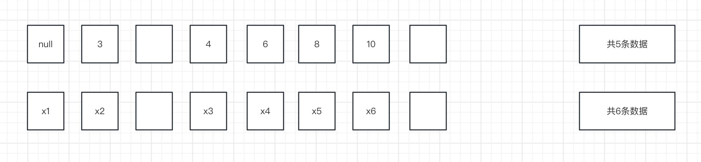

# Lab 5 B+ Tree Index

实验5的要求是实现基于B+树索引的增删查等操作，要点在于理解掌握数据库B+树索引的组织结构，理解在数据变更过程中树结构可能发生的更改。只要对B+树索引的结构掌握清楚，很快可以写出代码，相比lab4的事务处理和死锁更加简单。此实验我暂时仅实现了exercise1，考虑到实验收益不高，lab5暂时不继续往下做，因为代码结构和实现逻辑都比较明确。

在上手该实验之前，需要先理解BTreeInternalPage、BTreeLeafPage、BTreeRootPtrPage的代码。代码看起来很多，其实文件的解析占了很多，重点代码是描述B+树结构、调整B+树结构的部分。

**对于BTreeInternalPage，我简单画了一张图理解一下：**

（ internal nodes containing *m* keys have *m*+1 child pointers）

在磁盘文件上，keys不会为了与pointers的数量一致而空出一块内容；在BTreeInternalPage内，读取磁盘文件实例化对象时，对象中keys数组和pointers数组设置成一样的长度，keys数组位置0处置为null，这样如果keys[i]的值不为空，则children[i]为keys[i]右子节点的指针，children[i-1]为keys[i]左子节点的指针。

**header标识：**

header用于标识哪些slot被占用，其中的有效位数量与children长度一致，所以header中第一个有效位的含义和剩余有效位含义不太一样，它只说明children[0]有值。

**BTreeEntry抽象：**

至此，已经能够利用BTreeInternalPage获得所有entry数据条目（entry即key值加上左右子节点指针），但是这里的entry并不像HeapPage中的一个entry对应一个tuple那样清晰，为了使得BTreeInternalPage获取entry更加便捷，抽象出一个类BTreeEntry，表示一条entry。

整体上，相比HeapFile、HeapPage，B+树索引相关代码只是新增了不同类型的页面，整体代码结构类似、容易理解。